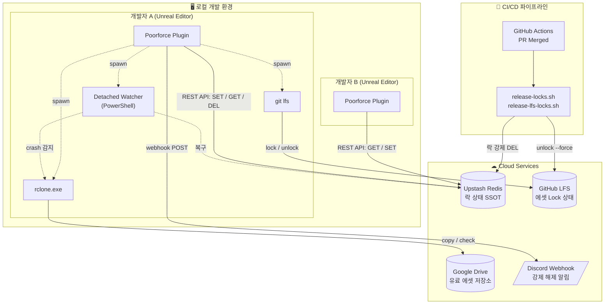
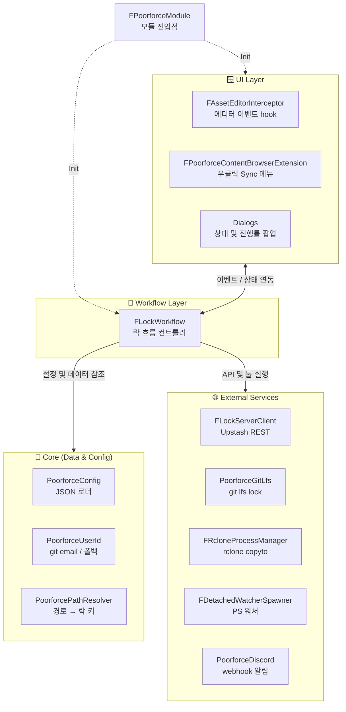
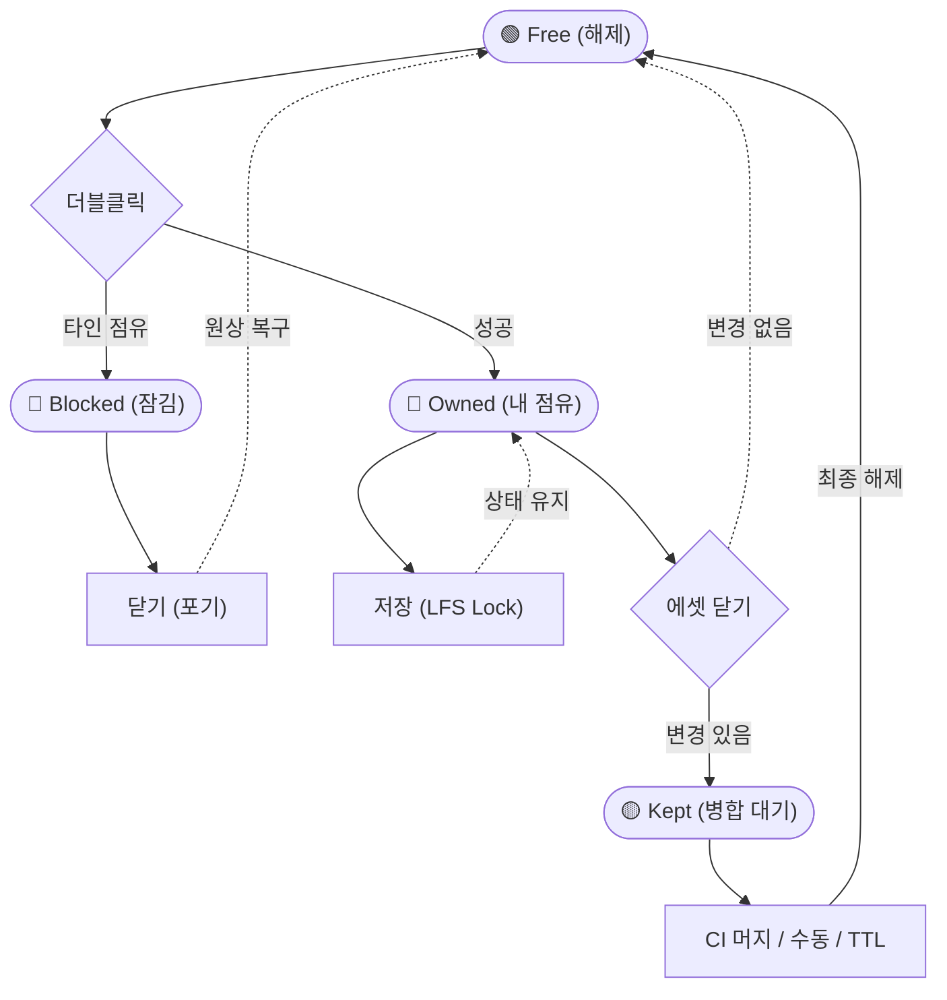
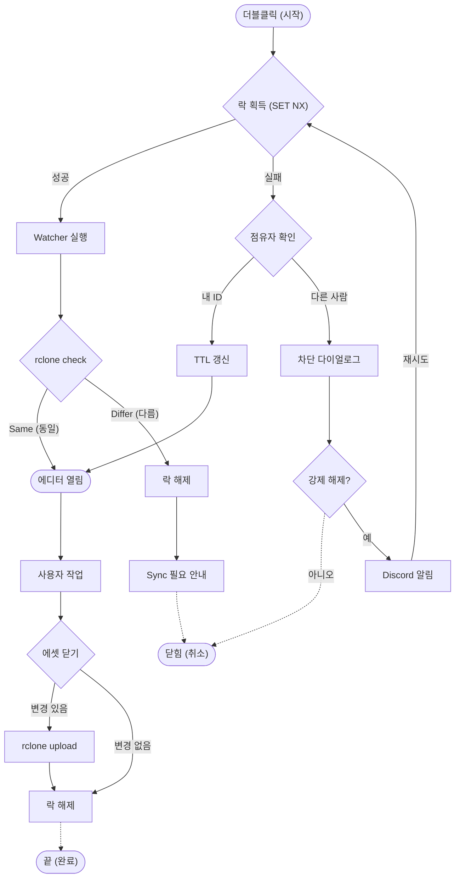
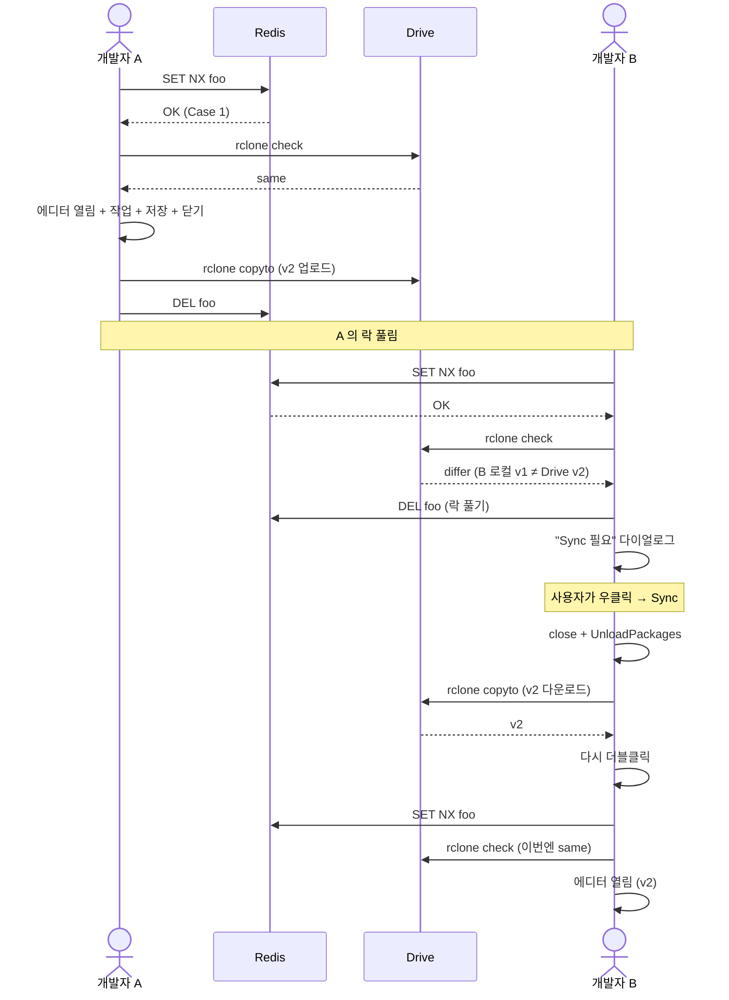
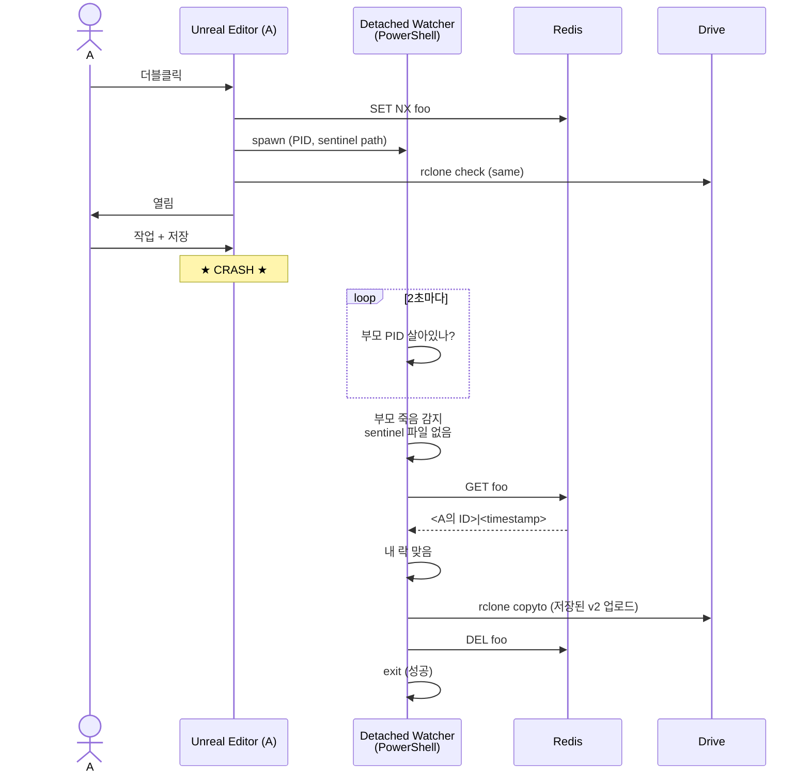
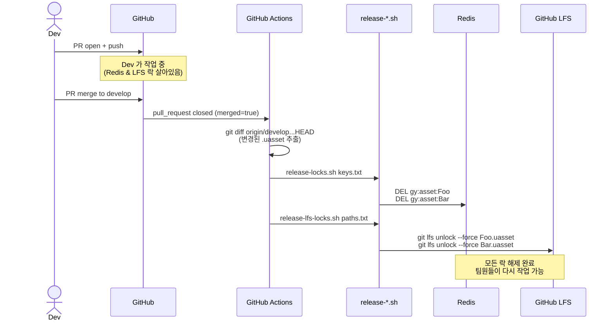
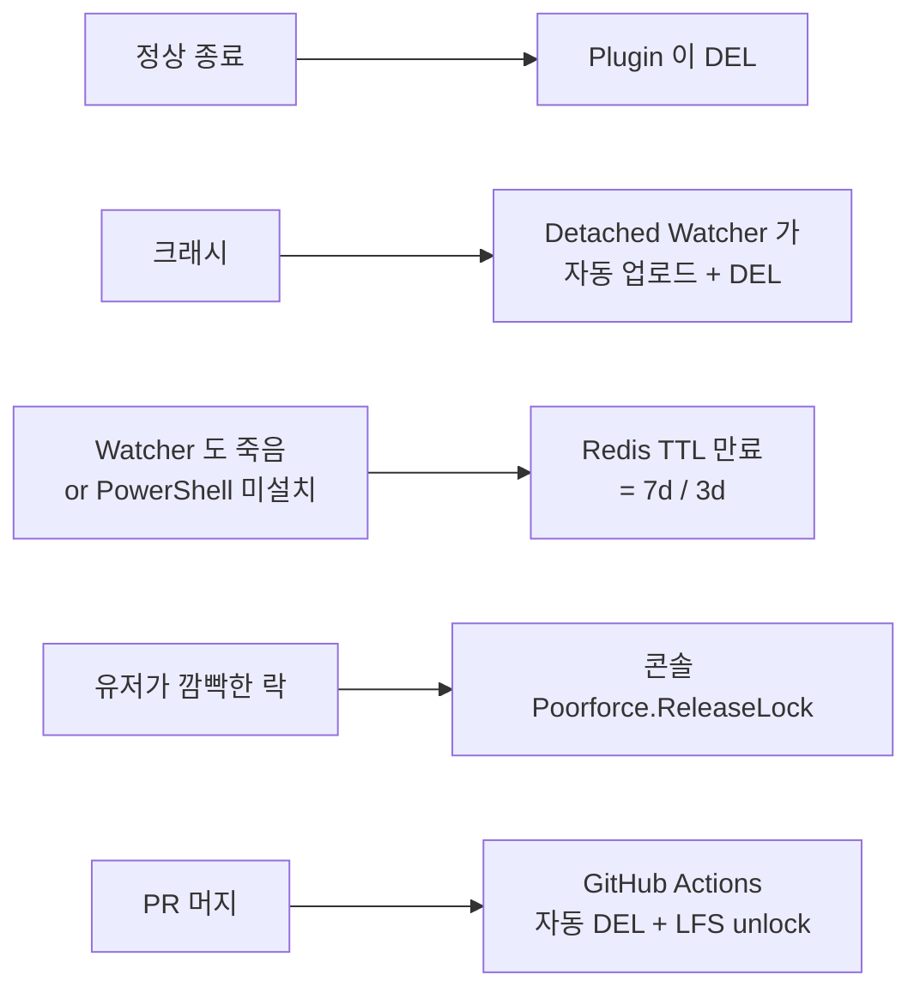

# Poorforce

학생/소규모 팀용 "Poor man's perforce" — Unreal Editor 에서 동시 편집 충돌을 방지하는 Redis 기반 락 시스템 + (선택) Google Drive 동기화.

**대상**: GitHub Free LFS (락 미지원) 같은 환경에서 Perforce/Plastic 없이 협업 잠금만 필요할 때.

## 문서

- 📦 [설치 가이드 (docs/SETUP.md)](docs/SETUP.md) — 처음 설치 + 팀원 셋업
- 📖 [사용 매뉴얼 (docs/MANUAL.md)](docs/MANUAL.md) — 콘솔 커맨드, CI 워크플로우, 트러블슈팅

---

## 핵심 개념

### 두 가지 모드

관리 대상 폴더를 `PoorforceConfig.json` 의 `ManagedPaths` 로 등록. 등록 안 된 폴더는 plugin 이 일체 관여 안 함.

| 모드 | 락 (Redis) | 파일 저장 | 용도 |
|------|-----------|---------|------|
| `LockOnly` | ✅ | **Git LFS** (사용자가 git push/pull) | 일반 무료 에셋 (git 으로 관리) |
| `LockAndSync` | ✅ | **Google Drive + Rclone** (plugin 자동) | 유료 에셋 (git 제외) |

### 분리된 책임

- **Redis**: 락 상태의 single source of truth. 어떤 사용자가 어떤 에셋을 작업 중인지
- **Google Drive (LockAndSync)**: 유료 에셋의 실제 데이터. plugin 이 자동 동기화
- **Git LFS (LockOnly)**: 일반 에셋의 데이터. 사용자가 git push/pull. plugin 은 락만 추가
- **CI (GitHub Actions)**: PR 머지 시 자동으로 Redis 락 + LFS 락 해제

---

## 시스템 아키텍처

---

## Plugin 내부 모듈 구조

---

## 락 라이프사이클

### LockOnly 흐름

### LockAndSync 흐름

---

## 협업 시나리오

### A 가 작업한 후 B 가 받기

### A 가 크래시 — 워처 자동 복구

### CI 가 PR 머지 시 락 자동 해제

---

## 안전망 계층

여러 계층의 fail-safe 로 락이 영구히 잠기지 않도록:

| 계층 | 시점 | 동작 |
|------|------|------|
| 1. 정상 종료 | 에셋 닫기 | Plugin 이 즉시 DEL |
| 2. 크래시 복구 | 에디터 강제 종료 후 | Detached Watcher 가 자동 업로드 + DEL |
| 3. TTL 만료 | 모든 위 단계 실패 시 | Redis 가 자동 만료 (`LockOnlyTtl`, `LockAndSyncTtl`) |
| 4. 수동 해제 | 사용자 의도 | 콘솔 `Poorforce.ReleaseLock <key>` |
| 5. CI 자동 해제 | PR 머지 | `release-locks.sh` / `release-lfs-locks.sh` |

---

## 참고사항

- **Windows 전용** (PowerShell 의존)
- **Upstash 토큰이 디스크에 평문 저장** (PoorforceConfig.json + 임시 워처 스크립트). git 에 안 올라가도록 `.gitignore` 필수
- **Content Browser 락 오버레이 없음** (Redis 호출 비용 문제로 보류)
- **워처가 죽으면 락 영구 유지** → TTL 이 최후 안전망
- **에셋 삭제 처리 없음** — Pre/PostDelete 훅 미구현. LockAndSync 삭제 시 업로드 실패 다이얼로그 뜨고 리모트 파일 안 지워짐. 일단 삭제 피하기
- **LockAndSync 자동 메모리 갱신 없음** — 더블클릭 시 자동 다운로드 안 함. 다른 사람이 업로드한 거 받으려면 명시적으로 우클릭 → Poorforce → Sync 필요
- **맵(.umap) 락 처리 미지원* — World 에셋은 main viewport 에 직접 로드되므로:
  - **Content Browser 더블클릭** 만 락 hook 발화. Redis 락 + LFS 락 정상 동작
  - **default map 자동 로드 / File > Open Level / LoadMap 호출** 은 hook 없음 → 락 안 잡힘
  - 락 충돌 다이얼로그가 떠도 맵 자체는 이미 로드돼서 차단 못 함
  - 시스템 정합성은 유지 (락 없으니 LFS lock 도 안 시도 → 다른 사람 변경 안 덮어씀)
  - **운영 규약 권장**: default map 은 수정하지 않는 placeholder 로 두고, 작업할 맵은 항상 Content Browser 에서 명시적으로 열기
